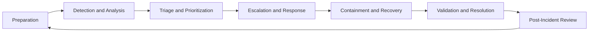

# Telecom Incident Management Playbook

A practical, framework-aligned portfolio project for managing telecommunications, network operations, IT service management, and cybersecurity-related incidents.

This repository provides reusable policies, runbooks, communication templates, lifecycle models, and anonymized case-study examples for incident handling in a NOC, service desk, MSP, or telecommunications support environment.

## Objectives

- Apply ITIL 4 concepts to operational incident management
- Align incident response practices with NIST guidance
- Support structured carrier/vendor escalation
- Improve technical documentation and customer communications
- Define measurable service-management KPIs and SLA practices
- Create reusable runbooks for common network incidents
- Demonstrate a practical bridge between telecom operations and cybersecurity incident response
- **Provide comprehensive NOC Tier 2 and Tier 3 technician training**

## Incident Lifecycle

This project uses a lifecycle aligned with NIST incident-handling guidance:

1. Preparation
2. Detection and analysis
3. Containment, eradication, and recovery
4. Post-incident activity and continuous improvement

## Frameworks

| Framework | How it is used in this project |
|---|---|
| ITIL 4 | Incident, problem, change, SLA, escalation, and continual improvement practices |
| NIST SP 800-61 | Incident response lifecycle and handling concepts |
| ISO/IEC 27035 | Security incident management governance and coordination |
| SANS PICERL | Preparation, Identification, Containment, Eradication, Recovery, and Lessons Learned |

## Repository Contents

| Folder | Purpose |
|---|---|
| `docs/` | Policies, lifecycle definitions, roles, KPIs, escalation standards, and **complete training program** |
| `frameworks/` | Mappings between ITIL, NIST, ISO 27035, and SANS |
| `runbooks/` | Step-by-step operational procedures for common incidents |
| `templates/` | Ticket notes, customer updates, carrier escalations, and PIR templates |
| `case-studies/` | Anonymized incident examples and lessons learned |
| `diagrams/` | Mermaid diagrams for lifecycle and escalation flows |
| `resources/` | Recommended study resources and references |
| **`docs/training/`** | **NOC Tier 2 & Tier 3 Technician Training Course (13+ modules)** |

## Example Use Cases

- Network circuit outage
- Firewall unreachable or down
- High latency and packet loss
- Carrier or ISP outage
- Major incident with multiple affected sites
- Potential DDoS or security-related network disruption

---

## 🎓 NOC Technician Training Program

This repository includes a **complete NOC Technician Training Program** with two certification tracks: **Tier 2 (Foundation)** and **Tier 3 (Advanced)**.

### Training Program Overview

| Track | Modules | Duration | Certifications |
|-------|---------|----------|----------------|
| **Tier 2 (Foundation)** | 13 core modules | 8–12 weeks | CompTIA Network+ (recommended) |
| **Tier 3 (Advanced)** | 5 advanced modules | 6–12 months | CompTIA Network+ + Fortinet NSE 4 (required) |

### Tier 2 Training Course (Foundation)

The Tier 2 course provides foundational knowledge for NOC technicians handling incidents, troubleshooting networks, and communicating with customers.

**13 Core Modules:**

1. **Customer Service & Communication Skills** – Professional communication, email templates, expectation management
2. **Network Troubleshooting Fundamentals** – Methodology, ping/traceroute/nslookup, systematic approach
3. **VoIP & Unified Communications Basics** – SIP/RTP, call flows, common issues, NAT/firewall impact
4. **Networking Foundations** – IP addressing, subnetting, routing, NAT, IPv6 basics
5. **Network Monitoring & Alerting** – SNMP, thresholds, dashboards, alert response
6. **Wireshark for VoIP Analysis** – Packet capture, SIP/RTP filtering, call quality metrics
7. **Firewall Administration Essentials** – Stateful firewalls, NAT, rules, SIP ALG, port testing
8. **VPN Fundamentals** – Remote access, site-to-site, split tunneling, troubleshooting
9. **Salesforce Service Cloud for NOC** – Case management, templates, macros, SLAs, escalations
10. **HPBX Platforms** – 8x8, CoreDial, Windstream, Intelepeer (administration and troubleshooting)
11. **Product-Specific Training** – BEC, CradlePoint, Ooma, Data Remote (cloud portals and failover)
12. **Vendor-Specific Networking** – Fortinet, Meraki, Cisco, Juniper, VeloCloud (CLI and GUI)
13. **CompTIA Network+ Foundation** – Exam prep, study plan, practice questions

**Tier 2 Deliverables:**
- ✅ 13 comprehensive training modules with teaching guides
- ✅ Hands-on exercises for each module (65+ total)
- ✅ Cheat sheets, quick reference guides, and templates
- ✅ Progress tracking sheet
- ✅ Certificate of completion template
- ✅ Instructor guide for teaching the course

**Start Here:** [`docs/training/README.md`](docs/training/README.md)

---

### Tier 3 Advanced Path

The Tier 3 Advanced Path builds upon Tier 2 with advanced technical expertise, root cause analysis, escalation handling, and problem management.

**5 Advanced Modules:**

- **Module A: Fortinet NSE 4 Advanced Firewall Administration** – Advanced routing, HA, security features, VPN, troubleshooting
- **Module B: Advanced Troubleshooting & Root Cause Analysis** – 5 Whys, fishbone diagrams, Wireshark deep-dive, performance baselines
- **Module C: Escalation Handling & Vendor Management** – Escalation criteria, vendor communication, escalation matrices, carrier NOC coordination
- **Module D: Problem Management & Process Improvement** – ITIL problem management, RCA documentation, change management, knowledge base creation
- **Module E: Advanced SD-WAN & Multi-Vendor Integration** – Application-aware routing, cloud on-ramp, service chaining, multi-vendor labs

**Tier 3 Deliverables:**
- ✅ Tier 3 Advanced Path guide (detailed module descriptions)
- ✅ 60+ quiz questions across all Tier 3 modules
- ✅ 5 advanced troubleshooting scenarios with evaluation rubric
- ✅ Career path guidance and certification roadmap
- ✅ Skills assessment checklist

**Learn More:** [`docs/training/tier3-advanced-path.md`](docs/training/tier3-advanced-path.md)

---

### Tier 2 vs. Tier 3 Comparison

| Aspect | Tier 2 | Tier 3 |
|--------|--------|--------|
| **Primary Focus** | Incident resolution, standard troubleshooting | Complex escalations, RCA, problem management |
| **Technical Depth** | Foundational networking, VoIP, firewall, VPN | Advanced routing, firewall (NSE 4), SD-WAN, multi-vendor |
| **Certifications** | CompTIA Network+ (recommended) | CompTIA Network+ + Fortinet NSE 4 (required) |
| **Experience Level** | 0–12 months NOC | 12–24+ months NOC |
| **Autonomy** | Standard incidents (Tier 1 escalations) | Complex, multi-system incidents (Tier 2 escalations) |
| **Deliverables** | Runbooks, templates, case documentation | RCA reports, problem records, process improvements, mentoring |

---

### How to Use This Training Program

**For self-study (Tier 2):**
1. Start with [`Module 1: Customer Service`](docs/training/topics/01-customer-service.md)
2. Complete all hands-on exercises for each module
3. Track your progress in the [`progress tracking sheet`](docs/training/progress-tracking.md)
4. Prepare for CompTIA Network+ certification (Module 13)

**For Tier 3 advancement:**
1. Complete all 13 Tier 2 modules first
2. Gain 6–12 months of hands-on Tier 2 experience
3. Start the [`Tier 3 Advanced Path`](docs/training/tier3-advanced-path.md)
4. Pursue Fortinet NSE 4 certification
5. Practice advanced troubleshooting scenarios

**For instructors:**
- See the [`Instructor Guide`](docs/training/instructor-guide.md) for teaching strategies, assessments, and lab setup.
- Use the [`Certificate Template`](docs/training/certificate-template.md) for course completion recognition.
- Utilize quiz questions and scenarios for assessments.

**For job seekers:**
- Reference this training when discussing your NOC and telecommunications knowledge in interviews.
- Highlight specific modules that align with the role you're applying for.
- Mention your CompTIA Network+ preparation (if pursuing certification).
- For Tier 3 roles, emphasize advanced troubleshooting scenarios and RCA experience.

---

## Professional Disclaimer

All examples in this repository are fictional or anonymized for educational and portfolio purposes. Do not include confidential customer information, internal processes, credentials, IP addresses, circuit identifiers, or private vendor ticket numbers.

## How to Use This Repository in Interviews

You can reference this repository when discussing:

- Incident management and ITSM experience
- NOC and telecommunications operations
- Cybersecurity incident response foundations
- Documentation, runbooks, and process improvement
- Communication with customers, carriers, and vendors
- **NOC technician training and development (Tier 2/Tier 3)**

Example talking points:

- "I built a telecom incident management playbook that maps our daily NOC work to ITIL 4 and NIST incident response."
- "I created runbooks and communication templates that standardize how we handle outages and carrier escalations."
- "I documented anonymized case studies to show how I apply detection, triage, escalation, and post-incident review in practice."
- **"I developed a complete NOC Tier 2 and Tier 3 training program with 18+ modules covering networking, VoIP, firewalls, SD-WAN, and problem management."**
- **"I created advanced troubleshooting scenarios and root cause analysis frameworks used for technician development."**

## For Recruiters

This repository demonstrates:

- Real-world NOC and telecommunications incident handling
- ITIL-aligned incident management practices
- NIST-based incident response concepts
- Bilingual (EN/ES) professional communication
- Clear documentation, runbooks, and process thinking
- **Comprehensive NOC technician training program (Tier 2 foundation + Tier 3 advanced)**
- **60+ quiz questions and 5 advanced troubleshooting scenarios for skills assessment**
- Commitment to continuous learning and professional development

Use the `docs/` folder to see how I structure policies, runbooks, metrics, and lessons learned.

**Explore the training program:** [`docs/training/README.md`](docs/training/README.md)

## Author

Created as a practical ITSM, NOC, telecommunications operations, and cybersecurity incident-response portfolio project.

**Training Program:** Developed to standardize NOC technician onboarding and provide a clear career path from Tier 1 → Tier 2 → Tier 3 → Senior/Engineering roles.

---

## Quick Links

- 📚 **Training Program Overview:** [`docs/training/README.md`](docs/training/README.md)
- 🎯 **Tier 2 Course Modules:** [`docs/training/topics/`](docs/training/topics/)
- 🚀 **Tier 3 Advanced Path:** [`docs/training/tier3-advanced-path.md`](docs/training/tier3-advanced-path.md)
- 📝 **Progress Tracking:** [`docs/training/progress-tracking.md`](docs/training/progress-tracking.md)
- 📋 **Quizzes & Assessments:** [`docs/training/tier3-quizzes.md`](docs/training/tier3-quizzes.md)
- 🔍 **Troubleshooting Scenarios:** [`docs/training/tier3-scenarios.md`](docs/training/tier3-scenarios.md)
- 🎓 **Instructor Guide:** [`docs/training/instructor-guide.md`](docs/training/instructor-guide.md)
- 📜 **Certificate Template:** [`docs/training/certificate-template.md`](docs/training/certificate-template.md)
