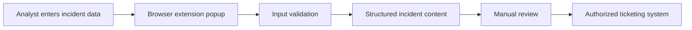

# Tool Architecture

## Security Principles

- Local processing where possible
- No unnecessary external network requests
- Least-privilege browser permissions
- No credential collection
- No transmission of confidential information
- Manual review before operational use
